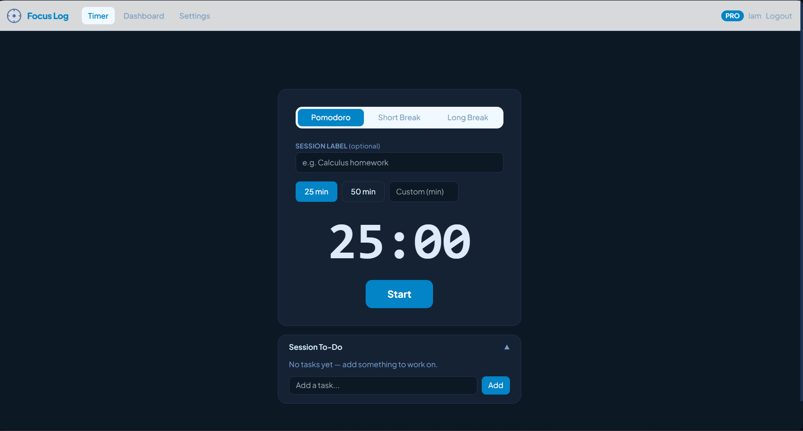

# Focus Log

Track focused study time, log distractions, and see your patterns over time. Built with a FastAPI backend, React frontend, JWT auth, and SQLite — no cloud account needed to run it.



## Stack

- **Frontend**: React + Vite + React Router v6 + Tailwind CSS
- **State**: React Context + useReducer
- **Storage**: SQLite via SQLAlchemy (default, zero config) · localStorage fallback for guest mode
- **Backend**: Python + FastAPI + Uvicorn
- **Auth**: JWT access tokens (15 min) + httpOnly refresh cookies (7 days) · Google OAuth
- **Email**: smtplib via Gmail app password + APScheduler daily reminders (requires SMTP config)

## Quickstart

### 1. Frontend

```bash
cd client && npm install && npm run dev
```

Frontend runs at http://localhost:5174

### 2. Backend

```bash
cd focus-log/server
python main.py
```

API runs at http://localhost:3001 · Docs at http://localhost:3001/docs

> **VS Code users:** The workspace auto-activates the root `.venv`. Run `python main.py` from `focus-log/server` — no manual activation needed. Tables are auto-created on first run (SQLite, no migration step required).

### 3. Environment (optional)

Copy and edit for SMTP or Google OAuth:

```bash
cp server/.env.example server/.env
```

Without `.env`, the server runs with SQLite and no email/Google features. JWT secrets default to placeholder values — change them for any non-local deployment.

### Environment variables

| Variable | Default | Purpose |
|---|---|---|
| `DATABASE_URL` | `sqlite:///./focuslog.db` | SQLite (default) or PostgreSQL URL |
| `JWT_SECRET` | `change-this` | Access token signing key |
| `JWT_REFRESH_SECRET` | `change-this-too` | Refresh token signing key |
| `GOOGLE_CLIENT_ID` | *(empty)* | Google OAuth client ID |
| `SMTP_USER` / `SMTP_PASS` | *(empty)* | Gmail app password for reminders |
| `APP_URL` | `http://localhost:5173` | Frontend origin (CORS) |
| `PORT` | `3001` | Backend port |

## Features

### Working

- **Timer** — countdown with 25/50 min presets, custom duration, pause/resume
- **Post-session form** — 10-star rating, distraction chip selector, contextual tips, reflection fields
- **Dashboard** — total/today/week time, avg rating, efficiency score, streak, bar chart, trend line, donut chart, session table
- **Auth** — email/password register + login, Google OAuth, JWT refresh flow
- **Session sync** — sessions persisted to SQLite for logged-in users; localStorage for guest mode
- **Guest mode** — full timer + dashboard without an account, data saved locally per device
- **Settings** — dark mode, font size, accent color, email reminder preferences
- **Multi-user isolation** — each user's localStorage sessions are keyed by email; no cross-account leakage

### Requires additional config

- **Email reminders** — daily APScheduler job, timezone-aware. Needs `SMTP_USER` + `SMTP_PASS` in `.env`
- **Google sign-in** — needs `GOOGLE_CLIENT_ID` in `.env` and a configured OAuth consent screen
- **PostgreSQL** — drop in a `DATABASE_URL=postgresql://...` to swap from SQLite. Install driver: `pip install psycopg2-binary`
- **Subscription / Pro plan** — upgrade flow UI exists, payment not implemented

## Database

SQLAlchemy models: [server/app/models.py](server/app/models.py)

Tables are created automatically on server startup (`Base.metadata.create_all`). No migration step needed for local development.

For schema migrations (PostgreSQL or team environments):

```bash
cd server
alembic revision --autogenerate -m "describe change"
alembic upgrade head
```

## Project structure

```
focus-log/
├── client/          # React frontend (Vite)
│   └── src/
│       ├── context/ # AuthContext, SessionContext, SettingsContext
│       ├── pages/   # Timer, Dashboard, Login, Register, Settings, Pricing
│       ├── components/
│       └── utils/storage.js
└── server/          # FastAPI backend
    ├── main.py
    └── app/
        ├── routers/ # auth, sessions, users, email
        ├── models.py
        ├── schemas.py
        ├── deps.py
        └── config.py
```
